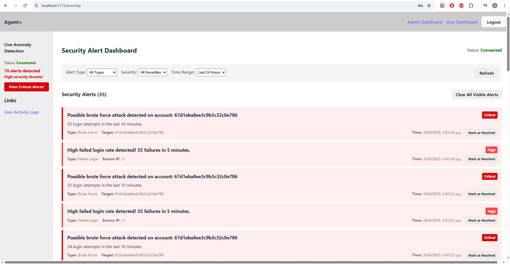

# Anomaly Detector

## 📊 About The Project

Anomaly Detector is a web application designed to identify unusual patterns in data streams. The system analyzes incoming data in real-time to detect potential security threats or irregularities, providing users with immediate alerts and visualization tools to investigate detected anomalies.

### Key Features

- **Real-time Anomaly Detection**: Continuously monitors data streams to identify outliers and unusual patterns
- **Interactive Visualization Dashboard**: Presents detected anomalies through customizable charts and graphs
- **Alert System**: Notifies users when suspicious activity is detected
- **Historical Analysis**: Stores and allows review of past anomalies for pattern recognition
- **Customizable Thresholds**: Allows users to define sensitivity levels for different types of data

## 🎥 Demo

*Click the image above to watch the demo video*

## 💻 Technology Stack

- **Frontend**: 
  - React.js for the user interface
  - Chart.js for data visualization
  - Bootstrap for responsive design
  - Socket.io (client) for real-time updates

- **Backend**:
  - Node.js with Express for API endpoints
  - Socket.io for real-time data transmission
  - Custom detection algorithms

## 🖼️ Screenshots

### Dashboard View

*The main dashboard displaying real-time data monitoring and anomaly visualization*

### Anomaly Charts

*Detailed view of a detected anomaly with charts*

### Alert Panel

*Alert panel for live anomalies*

## 🚀 Getting Started

### Prerequisites

- Node.js (v14 or higher)
- npm or yarn package manager

## 📈 Future Enhancements

- **Machine Learning Integration**: Implementing ML algorithms to improve anomaly detection accuracy
- **Advanced Visualization**: Additional chart types and visualization options
- **User Profiles**: Custom settings and preferences for different users
- **API Connectivity**: Integration with external data sources
- **Mobile Application**: Companion app for on-the-go monitoring

## 📝 License

Distributed under the MIT License. See `LICENSE` for more information.

## 📬 Contact

Anastasis Moraitis - [anastasismora@gmail.com](mailto:anastasismora@gmail.com)

LinkedIn: [https://www.linkedin.com/in/anastasis-moraitis-b60216327/](https://www.linkedin.com/in/anastasis-moraitis-b60216327/)

Project Link: [https://github.com/anastasis-mor/Anomaly-Detector](https://github.com/anastasis-mor/Anomaly-Detector)